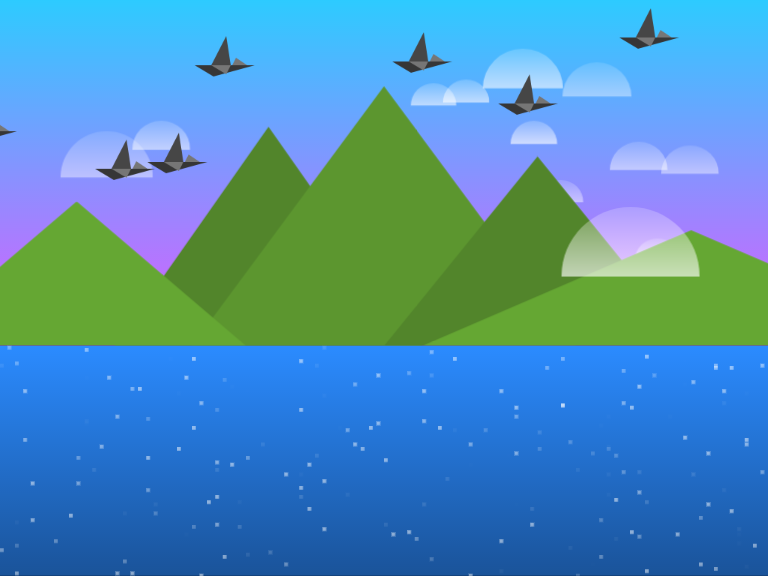

# Birds @ Sunset

This is a simple experiment with [Vue.js], [webpack], and [CSS3 animations]. The goal was to paint a picturesque canvas (not the literal [HTML5 canvas]) of birds flying over a mountain landscape.

#### How To Install

1. `npm install` : Install required modules
2. `npm run build` : Bundles assets for browser
3. `npm start` : Starts Webpack dev server

[Vue.js]: https://vuejs.org/
[webpack]: https://webpack.js.org/
[CSS3 animations]: https://developer.mozilla.org/en-US/docs/Web/CSS/animation
[HTML5 canvas]: https://developer.mozilla.org/en-US/docs/Web/API/Canvas_API
